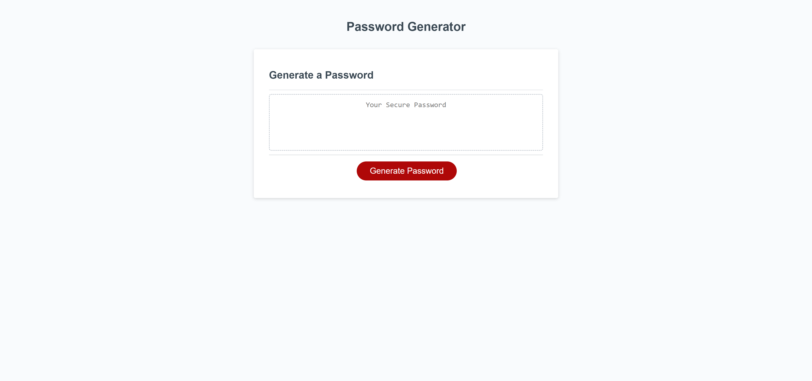

# Password Generator Starter Code

## Description

I made this password generator to test my knowledge and skills in javascript. It also gave me a handy tool for creating passwords for everyday use that should be random, safe and secure. I learned how to properly use string elements as part of an array, creating functions with multiple conditions, creating loops within said function and filling in empty variables within said function.

## Installation

To deploy this code on your own head to the repository located here https://github.com/rocas3096/Password-Generator. Once on the page, hit the code button and copy the repository using the https or ssh. Once complete open gitbash and head to your choosen directory where you wish to clone this code. When there, hit git clone then paste the link and the clone should copy to your local machine.

## Usage

To find this website, use this link. https://rocas3096.github.io/Password-Generator/

To review this repository, use this link. https://github.com/rocas3096/Password-Generator

## Credits

A thank you to Xander Rapstine (https://github.com/Xandromus) for the starter code for this project.

## License

N/A

---
